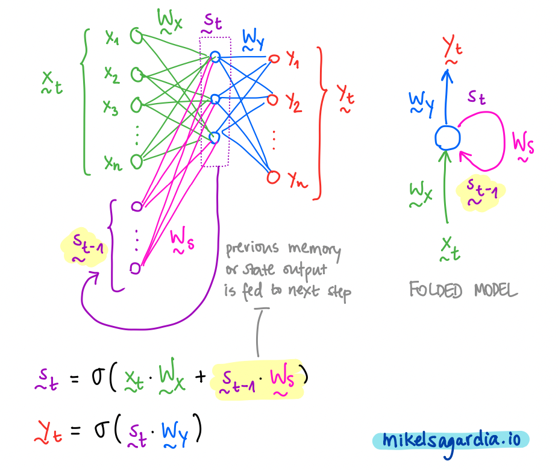

# Text Generation Project: Writing TV Scripts

This repository contains a text generator which works with a Recursive Neural Network (RNN) based on LSTM units. The [Seinfeld Chronicles Dataset from Kaggle](https://www.kaggle.com/datasets/thec03u5/seinfeld-chronicles) is used, which contains the complete scripts from the [Seinfield TV Show](https://en.wikipedia.org/wiki/Seinfeld).

The project is a modification of the [Character-level RNN](https://github.com/karpathy/char-rnn) [implemented by Andrej Karpathy](http://karpathy.github.io/2015/05/21/rnn-effectiveness/). I have used materials from the [Udacity Computer Vision Nanodegree](https://www.udacity.com/course/computer-vision-nanodegree--nd891), which can be obtained in their original form in [project-tv-script-generation](https://github.com/mxagar/deep-learning-v2-pytorch/tree/master/project-tv-script-generation).

Even though the text that the trained model is able to generate doesn't make much sense, it seems it follows the general structure that the scripts from the dataset have:

```
jerry: you know, it's the way i can do. i don't know what the hell happened.

jerry: what?

george: what about it?

elaine: i think you could be able to get out of here.

jerry: oh, i can't do anything about the guy.

jerry: what?

george:(smiling) yeah..........

george: you know, you should do the same thing.

jerry: i think i can.

jerry: oh, no, no! no. no.

jerry: i don't know.(to the phone) what do you think?

george: what?

jerry: oh, i think you're not a good friend.

...
```

... and that's with very few hours of effort and GPU training, so I I'd say it's a good starting point :smile:.

Table of Contents:

- [Text Generation Project: Writing TV Scripts](#text-generation-project-writing-tv-scripts)
  - [How to Use This](#how-to-use-this)
    - [Overview of Files and Contents](#overview-of-files-and-contents)
    - [Dependencies](#dependencies)
  - [Some Brief Notes on RNNs and Their Application to Language Modeling](#some-brief-notes-on-rnns-and-their-application-to-language-modeling)
    - [Text Preprocessing](#text-preprocessing)
    - [Recurrent Neural Networks](#recurrent-neural-networks)
    - [Final Mapping](#final-mapping)
  - [Practical Notes on the Text Generation Application](#practical-notes-on-the-text-generation-application)
  - [Improvements, Next Steps](#improvements-next-steps)
  - [Interesting Links](#interesting-links)
  - [Authorship](#authorship)

## How to Use This

In order to use the model, you need to install the [dependencies](#dependencies) and execute the notebook [tv_script_generation.ipynb](tv_script_generation.ipynb), which is the main application file that defines and trains the network.

Next, I give a more detailed description on the contents and the usage.

### Overview of Files and Contents

Altogether, the project directory contains the following files and folders:

```
.
├── Instructions.md                     # Original Udacity instructions
├── README.md                           # This file
├── data/                               # Dataset folder
│   └── Seinfeld_Scripts.txt            # Dataset: scripts
├── tv_script_generation.ipynb          # Project notebook
├── helper.py                           # Utilities: load/preprocess data, etc.
├── problem_unittests.py                # Unit tests
└── requirements.txt                    # Dependencies
```

As already introduced, the notebook [tv_script_generation.ipynb](tv_script_generation.ipynb) takes care of almost everything. That file uses the following two scripts:

- [helper.py](helper.py), which contains utility functions related to data preprocessing and model persisting,
- and [problem_unittests.py](problem_unittests.py), which contains the definitions of the unit tests run across the whole notebook.

All in all, the following sections/tasks are implemented in the project notebook:

- The dataset is loaded and briefly explored.
- The dataset is preprocessed: tokenization is performed, vocabulary dictionaries are created.
- A parametrized data loader is defined which delivers batches of token sequences with their expected target token. Basically, if we have a sequence `X` of `N` tokens, the target `y` is the next token in the script; and all that is provided in batches of a desired size.
- Definition of a RNN, which has:
  - An embedding layer.
  - An LSTM layer with parametrized layers within it.
  - A fully connected layer.
- Training of the network.
- Generation of new scripts.

When the complete notebook is executed, several other artifacts are generated:

- A binary with the pre-processed text.
- The trained models (best and last).
- A TV script generated with the trained model.

### Dependencies

You should create a python environment (e.g., with [conda](https://docs.conda.io/en/latest/)) and install the dependencies listed in the [requirements.txt](requirements.txt) file.

A short summary of commands required to have all in place is the following:

```bash
conda create -n text-gen python=3.6
conda activate text-gen
conda install pytorch -c pytorch 
conda install pip
pip install -r requirements.txt
```

## Some Brief Notes on RNNs and Their Application to Language Modeling

While [Convolutional Neural Networks (CNNs)](https://en.wikipedia.org/wiki/Convolutional_neural_network) are particularly good at capturing spatial relationships, [Recursive Neural Networks (RNNs)](https://en.wikipedia.org/wiki/Recurrent_neural_network) model sequential structures very efficiently. Also, in recent years, the [Transformer](https://en.wikipedia.org/wiki/Transformer_(machine_learning_model)) architecture has been shown to work remarkably well with language data -- but let's keep it aside for this small toy project.

### Text Preprocessing

In order to model language, the first step consists in transforming the text into numbers; to that end, (at least) the following tasks need to be carried out:

1. The text is [**tokenized**](https://en.wikipedia.org/wiki/Lexical_analysis#Tokenization): it is converted into a list of elements or tokens that have an identifiable unique meaning; these elements are usually words and related symbols, such as question marks or other punctuation elements.
2. A **vocabulary** is created: we create a dictionary with all the `n` unique tokens in the dataset which maps from the token string to an `id` and vice versa.
3. Tokens are **vectorized**: first, tokens are represented with **one-hot encoded** vectors, i.e., each of them is converted into a vector of length `(n,)` which contains all `0`-s except in the index/cell which corresponds to the token `id` in the vocabulary, where the value `1` is assigned. Second, those one-hot encoded vectors are compressed to an [**embedding space**](https://en.wikipedia.org/wiki/Embedding) consisting of vectors of size `(m,)`, with `m < n`. Those embedded vectors contain floating point numbers, i.e., they are not sparse as their one-hot encoded version, and they are obtained by using a fully connected layer. That fully connected embedding layer is usually the first step within the network, and it considerably improves the model efficiency. Typical reference sizes are `n = 70,000`, `m = 300`.

### Recurrent Neural Networks

Once we have sequences of vectorized tokens, we can feed them to recursive layers that learn patterns from them. Recursive layers are characterized by the following properties:

- Vectors of each sequence are fed one by one to them.
- Neurons that compose those layers keep a memory state.
- The memory state from the previous step, i.e., the one produced by the previous vectors in the sequence, is used in the current step to produce a new output and a new memory state.

The most basic recursive layer is the [Simple RNN or ELman Network](https://en.wikipedia.org/wiki/Recurrent_neural_network), depicted in the following figure:



In the picture, we can see that we have 3 vectors for each time step `t`: input `x`, output `y` and memory state `s`. Additionally, the previous memory state is used together with the current input to generate the new memory state, and that new memory state is mapped to be the output. In that process, 3 weight matrices are used (`W_x`, `W_y` and `W_s`), which are learned during training.

Unfortunately, simple RNNs or Elman networks suffer from the [**vanishing gradient**](https://en.wikipedia.org/wiki/Vanishing_gradient_problem) problem; due to that, in practice, they can reuse only 8-10 previous steps. Luckily, [**Long Short-Term Memory (LSTM) units**](https://en.wikipedia.org/wiki/Long_short-term_memory) were introduced by Schmidhuber et al. in 1997. LSTMs efficiently alleviate the vanishing gradient issue and they are able handle +1,000 steps backwards.

LSTM cells are differentiable units that perform several operations every step; those operations decide which information is removed from memory, which kept in it and which used to form an output. They segregate the memory input/output into two types, as shown in the next figure:

- short-term memory, which captures recent inputs and outputs.
- and long-term memory, which captures the context.


Therefore, in practice we have:

- Three inputs:
  - signal/event: `x_t`
  - previous short-term memory: `h_(t-1)`
  - previous long-term memory : `C_(t-1)`
- Three outputs: 
  - transformed signal or output: `y_t = h_t`
  - current/updated short-term memory: `h_t`
  - current/updated long-term memory: `C_t`

Note that the updated short-term memory is the signal output, too!

All 3 inputs are used in the cell in **4 different and interconnected gates** to generate the 3 outputs; these internal gates are:

- Forget gate: useless parts of previous long-term memory are forgotten, creating a lighter long-term memory.
- Learn gate: previous short-term memory and current event are learned.
- Remember gate: we mix the light long-term memory with forgotten parts and the learned information to form the new long-term memory.
- Use gate: similarly, we mix the light long-term memory with forgotten parts and the learned information to form the new short-term memory.

If you are interested in more detailed information, [Christopher Olah](https://colah.github.io/) has a great post which explains what's exactly happening inside an LSTM unit: [Understanding LSTM Networks](http://colah.github.io/posts/2015-08-Understanding-LSTMs/). Also, note that a simpler but similarly efficient alternative to LSTM cells are [**Gated Recurrent Units (GRUs)**](https://en.wikipedia.org/wiki/Gated_recurrent_unit).

### Final Mapping

Usually, 2-3 RNN layers are stacked one after the other and the final output vector sequence can be mapped to the desired space. For instance, in the case of the text generation example, I have used a fully connected layer which transforms the *last vector from the output sequence* to *one vector of the size of the vocabulary*; thus, given a sequence of words/tokens, the model is fit to predict the next most likely one. In other words, the RNN architecture is of the type [*many-to-one*](http://karpathy.github.io/2015/05/21/rnn-effectiveness/).

However, other types of architectures can be designed thanks to the sequential nature of the RNNs; for instance, we can define a *many-to-many* mapping, which is used to perform language translation, or *one-to-many*, employed in [image captioning](https://github.com/mxagar/image_captioning).

At the end of the day, we need to get the proper dataset we'd like to learn, apply the matrix mappings that match the input features with the target values and learn by optimization the weights within those matrices.

## Practical Notes on the Text Generation Application

Particular challenge: understanding the sizes of all the vectors.

- Batching sequences
- Overall definition of RNNs with LSTM units: the sizes of the different vectors, and how to deal with their reshaping.
- Hints on hyperparameter selection.

[Andrej Karpathy](https://github.com/karpathy/char-rnn)

## Improvements, Next Steps

- [ ] Try different model weight initializations (e.g., for the embedding layer) to check if it is possible to improve model convergence.
- [ ] Hyperparameter tuning.

## Interesting Links

- [My notes and code](https://github.com/mxagar/computer_vision_udacity) on the [Udacity Computer Vision Nanodegree](https://www.udacity.com/course/computer-vision-nanodegree--nd891).
- [My notes and code](https://github.com/mxagar/deep_learning_udacity) on the [Udacity Deep Learning Nanodegree](https://www.udacity.com/course/deep-learning-nanodegree--nd101).

Related interesting projects:

- [Character-level LSTM to generate text](https://github.com/mxagar/CVND_Exercises/blob/master/2_4_LSTMs/3_1.Chararacter-Level%20RNN%2C%20Exercise.ipynb), based on [a post by Andrej Karpathy](http://karpathy.github.io/2015/05/21/rnn-effectiveness/).
- Generating Bach music: [DeepBach](https://arxiv.org/pdf/1612.01010.pdf).
- Predicting seizures in intracranial EEG recordings: [American Epilepsy Society Seizure Prediction Challenge](https://www.kaggle.com/c/seizure-prediction).

## Authorship

Mikel Sagardia, 2022.  
No guarantees.

You are free to use this project, but please link it back to the original source.